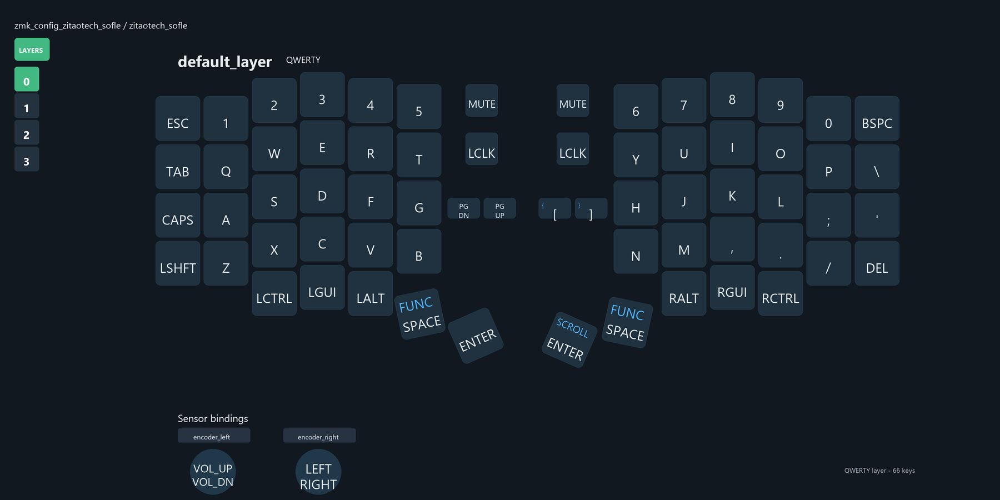
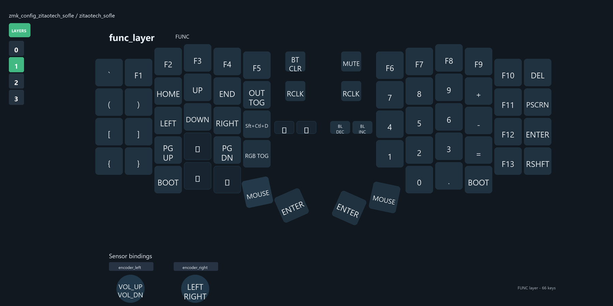
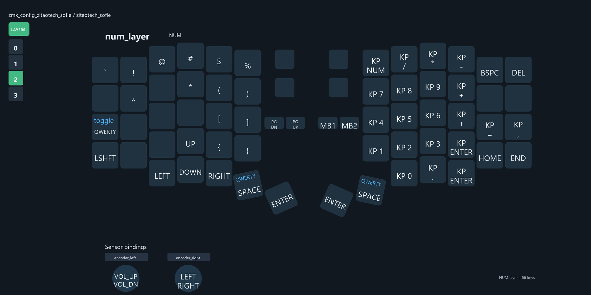
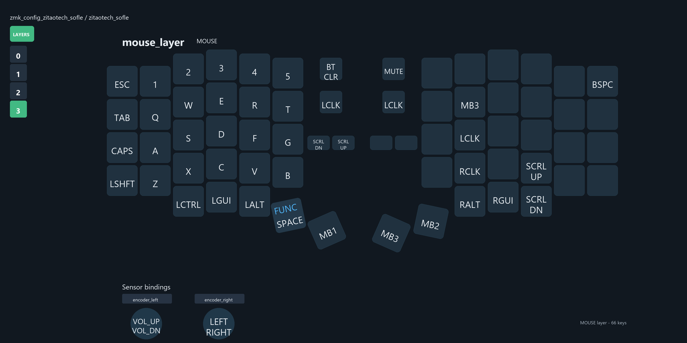

# zmk_config_zitaotech_sofle

ZitaoTech Sofle 分体键盘的 ZMK 用户配置。当前分支是 `word-layout-migration`，以根目录 `config/zitaotech_sofle.keymap` 作为日常维护和固件构建入口。

文档版本：`2026-05-29-enter-scroll-280ms`

## 当前状态

- 有效层数：4 层，分别是 `QWERTY`、`FUNC`、`NUM`、`MOUSE`。
- `MOUSE_layer` 仍是第 3 层，`zip_temp_layer 3 600` 仍指向它。
- QWERTY 两个 Space 使用 `&lt 1 SPACE`：短按 Space，长按进入 `FUNC`。
- `&lt` 的 `tapping-term-ms` 已调整为 `280ms`，降低 Space 误进层概率。
- QWERTY 中间 Enter 使用 `&sp_sc 0 ENTER`：短按 Enter，长按不向电脑发送按键，只作为滚动检测按住状态。
- 物理位 61 按住即可启用滚动检测，不再要求最高层必须是 `MOUSE_layer`。

## 维护入口

日常改键位优先维护：

- `config/zitaotech_sofle.keymap`
- `keymap-drawer/zitaotech_sofle.yaml`

README 中展示的四张键位图是参考 Word 文档截图风格重画的深色 PNG，不直接使用 keymap-drawer 的 SVG：

- 源数据：`keymap-drawer/zitaotech_sofle.yaml`
- 生成脚本：`scripts/generate_keymap_images.py`
- 输出图片：`docs/keymap-images/*.png`

这套 PNG 版式会把最左两列和最右两列按半格下沉绘制，避免旧图里外侧两列整体低一整格的问题。

`config/boards/arm/zitaotech_sofle/zitaotech_sofle.keymap` 是板级默认 keymap。当前也同步了 Enter/滚动和 280ms 改动，但实际日常维护仍以根目录 `config/zitaotech_sofle.keymap` 为准。

## 键位图

### QWERTY

### FUNC

### NUM

### MOUSE

## 层结构

| 层编号 | 显示名 | 节点名 | 主要入口 |
| --- | --- | --- | --- |
| 0 | QWERTY | `default_layer` | 默认层 |
| 1 | FUNC | `lower_layer` | QWERTY 拇指 `&lt 1 SPACE` |
| 2 | NUM | `raise_layer` | Caps 双击 `&to NUM` |
| 3 | MOUSE | `MOUSE_layer` | FUNC 拇指 `&mo 3`，以及 `zip_temp_layer 3 600` |

约束：

- `#define FUNC 1` 和 `#define NUM 2` 不要改错。
- `MOUSE_layer` 必须继续是第 3 层。
- `zip_temp_layer 3 600` 必须继续指向 `MOUSE_layer`。
- 不要重新引入 `RES_layer`、`#define RES`、`&to 4`、`&mo 4` 或 `&lt 4`。
- keymap-drawer 当前四层都是 66 个键位。

## 键位要点

- QWERTY 左侧 Caps 使用 `&TdCapToLay`：单击 Caps，双击跳到 `NUM`。
- QWERTY 两个 Space 使用 `&lt 1 SPACE`，并通过 `&lt { tapping-term-ms = <280>; };` 拉长 hold 判定。
- QWERTY 中间 Enter 使用 `&sp_sc 0 ENTER`。`sp_sc` 是 tap-preferred hold-tap，`tapping-term-ms = <280>`，hold 行为是 `&none`，tap 行为是 `&kp ENTER`。
- FUNC 层 QWERTY 的 `G` 位置是 `&kp LS(LC(D))`，drawer 标为 `Sft+Ctl+D`。
- NUM 层是符号和小键盘层，可通过 `&to 0` 或 `&lt 0 SPACE` 回到 QWERTY。
- MOUSE 层保留鼠标键、滚动键和基础键位；默认层 Enter 不再长按发送 `MB3`。

## 指点设备

本配置包含三个指点设备：

- 右手 TrackPoint：`config/boards/shields/right_trackpoint/custom_driver_right/trackpoint_0x15.c`
- 左手 A320 trackpad：`config/boards/shields/left_bbtrackpad/custom_driver_left/a320.c`
- 左手 BB trackball：`config/boards/shields/left_bbtrackball/custom_driver_left/bbtrackball_input_handler.c`

物理位约定：

| 物理位 | 用途 |
| --- | --- |
| 34 | 方向键模式 |
| 36 | 慢速/精细模式 |
| 61 | 滚动模式 |

物理位 60 不再参与滚动监听。

## 滚动逻辑

右手 TrackPoint 是 split peripheral，不能在右手固件里直接调用 `zmk_keymap_highest_layer_active()`。现在右手驱动只负责读取 TrackPoint 并上报 X/Y 或方向键输入，滚动转换由左手 central 侧完成：

- 代码：`config/boards/arm/zitaotech_sofle/custom_driver_left/trackpoint_scroll_processor.c`
- 绑定：`config/dts/bindings/input_processors/zitaotech,trackpoint-scroll-processor.yaml`
- DTS 挂载：`config/boards/arm/zitaotech_sofle/zitaotech_sofle_left.dts`

当前逻辑：

- CapsLock 开启时，指点移动转滚轮。
- 或者物理位 61 按住时，指点移动转滚轮。
- 其他情况下，指点设备继续作为鼠标指针移动。
- TrackPoint 的 `trackpoint_scroll_processor` 在 `trackpoint_listener` 里位于 `zip_temp_layer 3 600` 前面。

左手 A320 trackpad 和 BB trackball 也按同样思路处理：物理位 61 或 CapsLock 触发滚动，不再额外要求当前最高层是 `MOUSE_layer`。

## 构建与验收

GitHub Actions 的 `Build ZMK firmware` 会按 `build.yaml` 构建 6 个固件：

- `zitaotech_sofle_left` + `lpm_view;left_bbtrackball`
- `zitaotech_sofle_left` + `lpm_view;left_bbtrackpad`
- `zitaotech_sofle_right` + `lpm_view;right_trackpoint`
- 以上三项各自加 `settings_reset`

建议每次修改后检查：

- `git diff --check`
- 必要时手动触发 `Build ZMK firmware`

上板验收重点：

- Caps 单击/双击行为正确，双击进入 `NUM`。
- QWERTY 拇指 Space 轻敲/按住行为正确，长按进 `FUNC` 不迟钝。
- QWERTY 中间 Enter 短按正常回车，长按配合指点设备滚动，不再触发鼠标中键。
- Word 输入时删除、空格、回车不再偶发焦点跳转。
- TrackPoint、A320 trackpad、BB trackball 在物理位 61 或 CapsLock 下能滚动。
- 物理位 34 和 36 分别仍触发方向键模式与慢速/精细模式。

## 注意事项

- `firmware.zip` 是本地下载的构建产物，已在 `.gitignore` 中忽略。
- `keymap-drawer/zitaotech_sofle.svg` 是 drawer 自动生成产物；README 当前不直接使用它。
- 如果改了 `keymap-drawer/zitaotech_sofle.yaml`，请重新运行 `python scripts/generate_keymap_images.py` 更新 README 中的四张 PNG。
